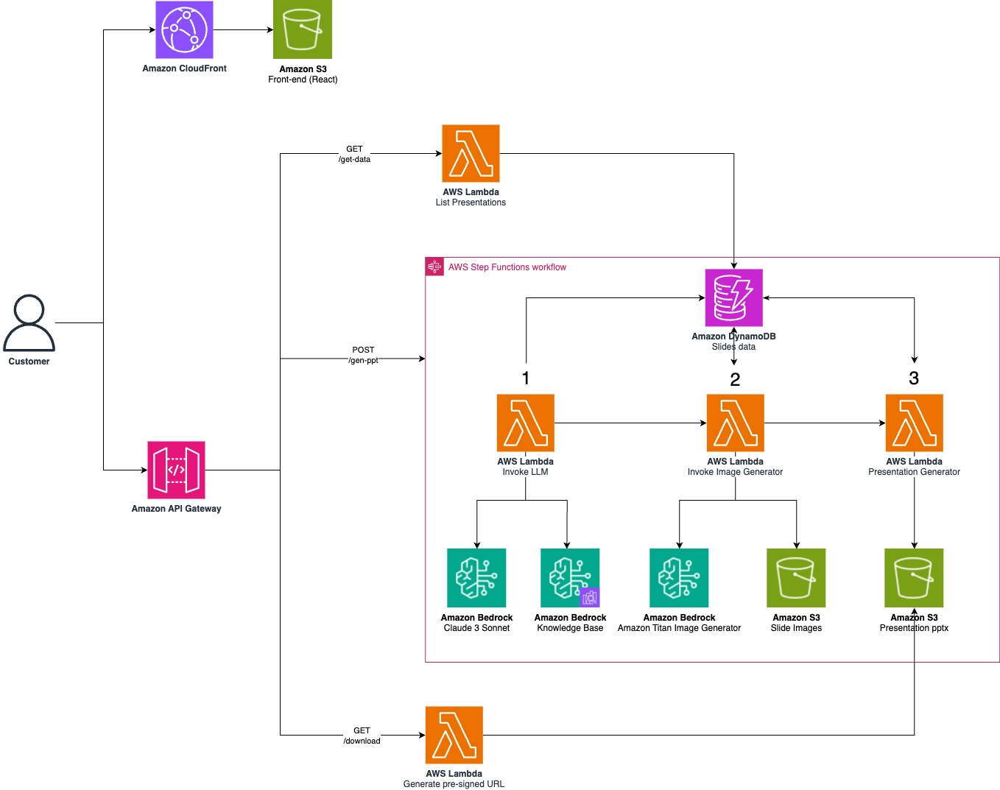

# AWS Presentations Generator demo Generative AI

## Architecture

## Prerequisites

1. It is recommended to run this sample in a **sandbox account**. The sample has no tests and not all security best practices are implemented.
2. [AWS CLI](https://docs.aws.amazon.com/en_us/cli/latest/userguide/getting-started-install.html) configured with a user that has Admin permissions. This user will be used by AWS SAM
3. [AWS SAM CLI](https://docs.aws.amazon.com/serverless-application-model/latest/developerguide/install-sam-cli.html) installed
4. Solution tested in _us-east-1_ region
5. Node.js v18.16.0, NPM v9.5.1, Python v3.12
6. Docker installed

## Getting Started

1. [Manage Amazon Bedrock model access](https://docs.aws.amazon.com/bedrock/latest/userguide/model-access.html)
2. Deploy the [backend](./backend/README.md)
3. Add your content and sync Bedrock KB
4. Change the API endpoint in [services](./frontend/src/services/api.js)
5. Deploy the [frontend](./frontend/README.md)

## Disclaimer

Sample code, software libraries, command line tools, proofs of concept, templates, or other related technology are provided as AWS Content or Third-Party Content under the AWS Customer Agreement, or the relevant written agreement between you and AWS (whichever applies). You should not use this AWS Content or Third-Party Content in your production accounts, or on production or other critical data. You are responsible for testing, securing, and optimizing the AWS Content or Third-Party Content, such as sample code, as appropriate for production grade use based on your specific quality control practices and standards. Deploying AWS Content or Third-Party Content may incur AWS charges for creating or using AWS chargeable resources, such as running Amazon EC2 instances or using Amazon S3 storage.